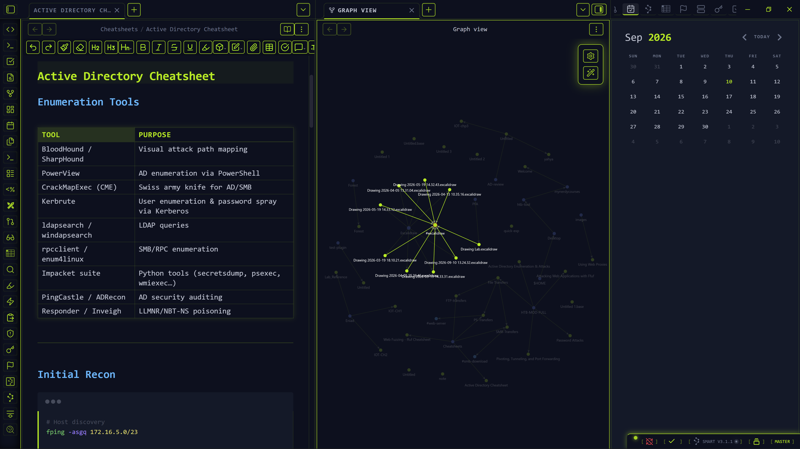

# HTB HUD

**Author:** DR4V3N1X (Yahya Ouarrak)  
**Version:** 1.1.0  

just another boring theme

---

## Installation

1. Open Obsidian **Settings** -> **Appearance**.
2. Click **Manage** under Themes.
3. Search for **HTB HUD** and click **Install and Use**.

## Required Plugins

To customize the theme, you must install the **Style Settings** community plugin:
1. Go to **Settings** -> **Community Plugins** -> **Browse**.
2. Search for **Style Settings** and install/enable it.
3. You will now see an "HTB HUD" section in the Style Settings menu.

## Features & Customization

Through the Style Settings plugin, you can customize:
- **Base HUD Colors:** Change the primary neon accent color, background color, and text colors.
- **Heading Colors:** Set custom individual colors for H1 through H6 headers.
- **Sharp Corners:** Toggle the UI between smooth rounded corners or sharp, blocky terminal corners.
- **HUD Tooltips:** Enable glowing data tooltips on hover.
- **Ambient Boot Animation:** Turn the empty workspace radar animation on or off.

---

## Showcase

### The Workspace
*(Save a screenshot named workspace.png into an images/ folder in your repository)*

### Hardware Config & Settings

### Command Targeting

### Graph View Radar

